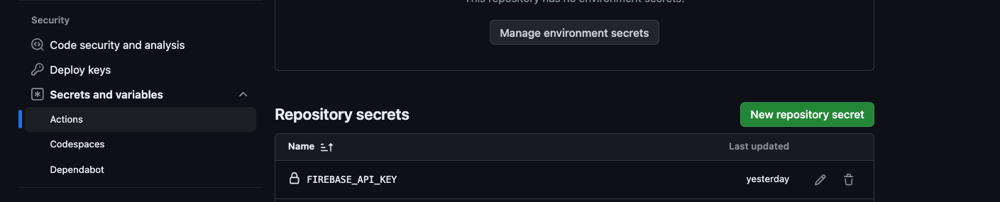

<div style='display: flex; justify-content: center; align-items: center;'>
  <div style='padding-right: 8px; text-align: right;'>
    <span style='font-size: 0.8em; opacity: 0.5;'>Published</span>
    <br />
    March 7, 2024
  </div>
    
  <div style='padding-left: 8px'>
    <span style='font-size: 0.8em; opacity: 0.5;'>Written By</span>
    <br />
    Ethan Bonsignori
  </div>
</div>

<div style='text-align: center; font-style: italic; margin: 30px 0;'>
A quick guide on automating deployments for a Firebase Hosting project using GitHub Actions and how to access Environment Variables in your project.
</div>

Because Firebase Hosting is a static web hosting service, it's easy to automate deployments using GitHub Actions, but makes it a bit tricky to access secrets that you do not want to expose. This guide will walk you through setting up a GitHub Action to deploy your Firebase Hosting project while still being able to access your secrets.

### 1. Setting up GitHub Actions

The Firebase CLI makes this part extremely simple, and you can follow how to set up GitHub Actions for Firebase Hosting [here](https://firebase.google.com/docs/hosting/github-integration). But the TL;DR is:

1. Install the Firebase CLI if you haven't already

```bash
npm install -g firebase-tools
```

2. Initialize hosting in your project if you haven't already

```bash
firebase init hosting
```

3. Run the automated setup script and follow the prompts to setup GitHub Actions

```bash
firebase init hosting:github
```

4. It will create two actions, but the one we care about for this purpose should look something like this:

```yaml
# This file was auto-generated by the Firebase CLI
# https://github.com/firebase/firebase-tools

name: Deploy to Firebase Hosting on merge
'on':
  push:
    branches:
      - main

jobs:
  build_and_deploy:
    runs-on: ubuntu-latest

    steps:
      - uses: actions/checkout@v4
      - run: npm ci && npm run build
      - uses: FirebaseExtended/action-hosting-deploy@v0
        with:
          repoToken: '${{ secrets.GITHUB_TOKEN }}'
          firebaseServiceAccount: '${{ secrets.FIREBASE_SERVICE_ACCOUNT_ETHAN_PORTFOLIO }}'
          channelId: live
          projectId: ethan-portfolio
```

### 2. Accessing Environment Variables/Secrets

As I said above, this is where it can get tricky, since you don't want to expose your secrets. The way to do this is to use GitHub Secrets. You can read more about GitHub Secrets [here](https://docs.github.com/en/actions/reference/encrypted-secrets).

<a target="_blank" href="../images/blogs/4/secrets-actions.png" title="View original image">
 actions">
</a>

Navigate to your repositories settings, and on the left-hand side under "Security", click on "Secrets and variables" -> "Actions". Here you can add your secrets.

For demonstration purposes, we'll add a secret for the `FIREBASE_API_KEY` that is provided when you initialize an Web App in your Firebase Project. You can add a secret by clicking on the "New repository secret" button and adding the name and value of your secret. **Make sure to add it under Repository secrets and not Environment secrets.**

Now we can access the secret in our generated action from above by using the `${{ secrets.SECRET_NAME }}` syntax. So in our case, we need to ENV variable to be accessed at build time, so we can add the `env:` property under the build step like so:

```yaml
jobs:
  build_and_deploy:
    runs-on: ubuntu-latest

    steps:
      - uses: actions/checkout@v4
      - run: npm ci && npm run build
        env:
          FIREBASE_API_KEY: ${{ secrets.FIREBASE_API_KEY }}
          ...
```

And that's it! Now you can access your secrets in your GitHub Actions and automate your Firebase Hosting deployments the code that initializes your firebase app in your project by using the `process.env.FIREBASE_API_KEY` syntax will now have access to the secret.

_Last updated March 7, 2024_
